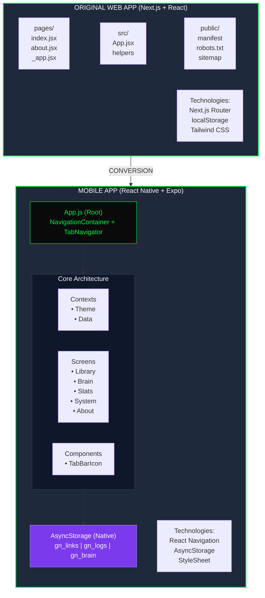
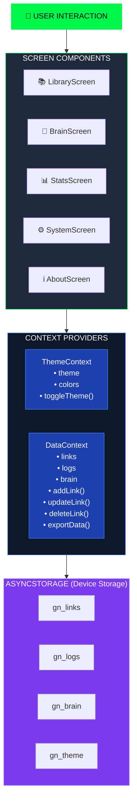
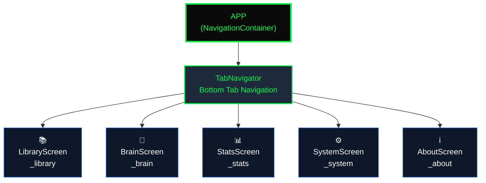
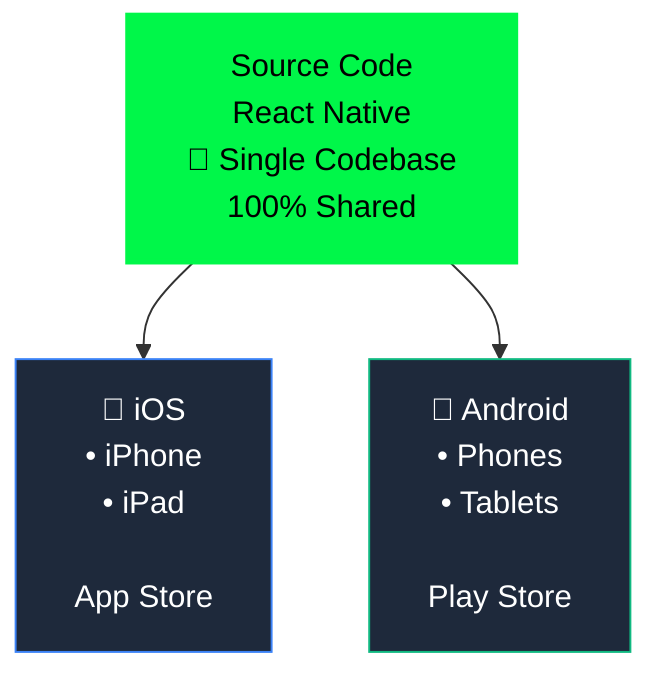
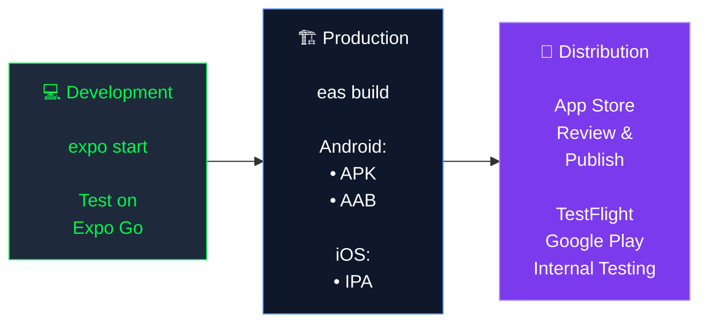

# 📊 Architecture Diagram


## Web to Mobile Conversion Flow



## Component Mapping

```
WEB COMPONENT                    →    MOBILE COMPONENT
─────────────────────────────────────────────────────────────────

Next.js Page                     →    Screen Component
  pages/index.jsx                →    LibraryScreen.js
  pages/about.jsx                →    AboutScreen.js
  src/App.jsx (tools view)       →    BrainScreen.js
  src/App.jsx (stats view)       →    StatsScreen.js
  src/App.jsx (sys view)         →    SystemScreen.js

Next.js Router                   →    React Navigation
  useRouter()                    →    useNavigation()
  router.push('/about')          →    navigation.navigate('_about')

HTML/CSS Elements                →    React Native Components
  <div>                          →    <View>
  <span>, <p>, <h1>             →    <Text>
  <input>                        →    <TextInput>
  <button>                       →    <TouchableOpacity>
  className="..."                →    style={styles.xxx}

Browser APIs                     →    Expo/React Native APIs
  localStorage                   →    AsyncStorage
  window.location                →    Linking
  navigator.clipboard            →    expo-clipboard
  File download                  →    expo-file-system
  Share API                      →    expo-sharing
  
State Management                 →    Context API
  Local state in components      →    ThemeContext
  Props drilling                 →    DataContext
```

## Data Flow Architecture



## Navigation Structure



## Storage Schema

```
AsyncStorage Keys:
┌─────────────────────────────────────────────────────────────────┐
│                                                                   │
│  gn_links:                                                        │
│  [                                                                │
│    {                                                              │
│      id: "abc123",                                               │
│      url: "https://example.com",                                 │
│      title: "Example Site",                                      │
│      tags: ["tech", "news"],                                     │
│      pinned: false,                                              │
│      archived: false,                                            │
│      clicks: 5,                                                  │
│      created: "2025-01-01T00:00:00.000Z",                       │
│      clicked: "2025-01-02T00:00:00.000Z"                        │
│    }                                                             │
│  ]                                                               │
│                                                                   │
│  gn_logs:                                                         │
│  [                                                                │
│    {                                                              │
│      id: "log123",                                               │
│      timestamp: "2025-01-01T00:00:00.000Z",                     │
│      action: "ADD",                                              │
│      details: "Created: Example Site"                            │
│    }                                                             │
│  ]                                                               │
│                                                                   │
│  gn_brain:                                                        │
│  {                                                                │
│    messages: [                                                    │
│      {                                                            │
│        id: 1,                                                     │
│        role: "user",                                             │
│        content: "Hello",                                         │
│        timestamp: "2025-01-01T00:00:00.000Z"                    │
│      }                                                           │
│    ],                                                            │
│    sources: [                                                     │
│      {                                                            │
│        id: 1,                                                     │
│        url: "https://example.com",                               │
│        title: "Example",                                         │
│        timestamp: "2025-01-01T00:00:00.000Z"                    │
│      }                                                           │
│    ]                                                             │
│  }                                                               │
│                                                                   │
│  gn_theme: "dark" | "light"                                      │
│                                                                   │
└─────────────────────────────────────────────────────────────────┘
```

## Platform Support



## Build & Deploy Pipeline



---

**Visual Reference Only** - See actual code in the `src/` directory.
